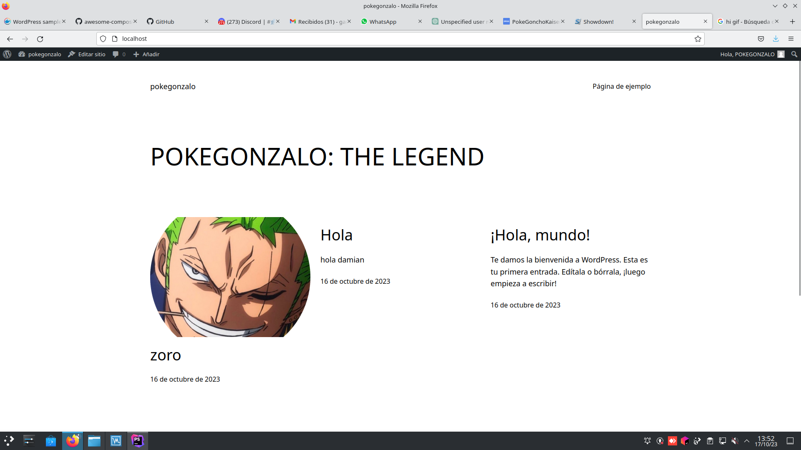

# Docker Compose para WordPress con MariaDB

## Primer paso: 

### Creamos un archivo .yml vacio para el docker compose

## Segundo paso:
### Configuramos el docker compose de la siguiente forma:

- **version:** '3.1'
Esta línea indica la versión de Docker Compose que se está utilizando. En este caso, es la versión 3.1.

- **services:**
Aquí comienza el apartado de servicios. En este caso, hay dos servicios: db y wordpress.

### Servicio `db` (MariaDB)

- **Imagen**: mariadb:10.6.4-focal
- **Comando**: `--default-authentication-plugin=mysql_native_password`
- **Volumen**: `db_data:/var/lib/mysql`
- **Variables de Entorno**:
  - `MYSQL_ROOT_PASSWORD=wordpress`
  - `MYSQL_DATABASE=wordpress`
  - `MYSQL_USER=wordpress`
  - `MYSQL_PASSWORD=wordpress`
- **Puertos Externos**: 3306, 33060

- **imagen:** mariadb:10.6.4-focal: Especifica la imagen de Docker que se utilizará para este servicio. En este caso, se utiliza la imagen de MariaDB con la versión 10.6.4.

- **commando:** '--default-authentication-plugin=mysql_native_password': Especifica un comando que se ejecutará cuando el contenedor se inicie. En este caso, se está configurando el plugin de autenticación de MySQL.

- **volúmenes:** - db_data:/var/lib/mysql: Establece un volumen para guardar los datos de la base de datos en el directorio /var/lib/mysql dentro del contenedor.

- **entorno:** - MYSQL_ROOT_PASSWORD=wordpress - MYSQL_DATABASE=wordpress - MYSQL_USER=wordpress - MYSQL_PASSWORD=wordpress: Define variables que se utilizarán en el contenedor. Estas variables configuran la contraseña del usuario root de MySQL, el nombre de la base de datos, el usuario y la contraseña.

- **expose:** - 3306 - 33060: Abre los puertos 3306 y 33060 del contenedor. Esto permite que otros contenedores en la misma red puedan comunicarse con el servicio de base de datos.

### Servicio `wordpress`

- **Imagen**: wordpress:latest
- **Volumen**: `wp_data:/var/www/html`
- **Puertos Externos**: 80
- **Variables de Entorno**:
  - `WORDPRESS_DB_HOST=db`
  - `WORDPRESS_DB_USER=wordpress`
  - `WORDPRESS_DB_PASSWORD=wordpress`
  - `WORDPRESS_DB_NAME=wordpress`
- **imagen:** wordpress:latest: Especifica la imagen de Docker que se utilizará para este servicio. En este caso, se utiliza la imagen más reciente de WordPress.

- **volumenes:** - wp_data:/var/www/html: Establece un volumen para persistir los datos del sitio web WordPress en el directorio /var/www/html dentro del contenedor.

- **puertos:** - 80:80: Asocia el puerto 80 del host (tu ordenador) al puerto 80 del contenedor, lo que permite acceder al sitio web WordPress a través del navegador.

- **entorno:** - WORDPRESS_DB_HOST=db - WORDPRESS_DB_USER=wordpress - WORDPRESS_DB_PASSWORD=wordpress - WORDPRESS_DB_NAME=wordpress: Define variables de entorno que especifican cómo conectarse a la base de datos. Estas variables coinciden con las configuraciones establecidas en el servicio db.

### Volumenes:

volumes:
  db_data:
  wp_data:

Establece los volúmenes llamados db_data y wp_data. Estos volúmenes se utilizan para persistir los datos de la base de datos y el sitio web WordPress respectivamente.

## Tercer Paso

Nos conectamos a nuestro wordpress accediendo con nuestra ip+el puerto que hemos usado en este caso 10.0.9.3:80  y con esto pasaremos a una ventana de configuracion de nuestro wordpress en el que tras poner un usuario y contraseña que condireremos ya podremos ver nuestra página tal que así :  
